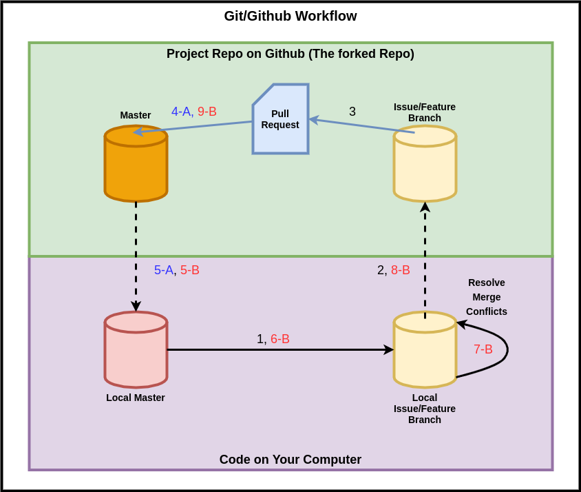

# Git and GitHub

This document outlines how to collaborate with others using git and github (or any other similar services).

## Contents

<!-- toc -->

- [Git and GitHub](#git-and-github)
  - [Contents](#contents)
  - [Pre-requisite:](#pre-requisite)
  - [Note](#note)
  - [Some Useful General Commands](#some-useful-general-commands)
    - [git status](#git-status)
    - [git remote -v](#git-remote--v)
    - [git log](#git-log)
    - [git stash](#git-stash)
  - [Workflow Diagram](#workflow-diagram)
  - [Golden Rule](#golden-rule)
  - [Step 1: Branching and Working](#step-1-branching-and-working)
  - [Step 2: Push Changes to GitHub Repo](#step-2-push-changes-to-github-repo)
  - [Step 3: Make a PR](#step-3-make-a-pr)
  - [Step 4-A: Merge PR](#step-4-a-merge-pr)
  - [Step 5-A: Update Local Master](#step-5-a-update-local-master)
  - [You Are Done](#you-are-done)
  - [Step 4-B: Dont Do anything on Github](#step-4-b-dont-do-anything-on-github)
  - [Step 5-B: Update Local master](#step-5-b-update-local-master)
  - [Step 6-B: Update Issue branch](#step-6-b-update-issue-branch)
  - [Step 7-B: Resolve Merge Conflicts](#step-7-b-resolve-merge-conflicts)
  - [Step 8-B: Push Resolved Changes](#step-8-b-push-resolved-changes)
  - [Step 9-B: You are done...almost](#step-9-b-you-are-donealmost)
  - [Step 10: Start working on next feature on new branch](#step-10-start-working-on-next-feature-on-new-branch)

<!-- tocstop -->

## Pre-requisite:

> You have already cloned from your forked repo using the command below

```bash
git clone repo_url
```

## Note

I am being verbose with my commands, for example

```bash
# this says to push to the provided branchName
# in the remote repo named origin
git push origin branchName

# Similarly
git pull origin master
```

In most cases you can simply get away executing git push or git pull instead. But I like being specific. I find this leads to less unexpected errors

## Some Useful General Commands

### git status

This will show all the files that have changed but not added(ie staged) and also once that have beend added but not commited

1. Files not added therefore not commited are colored red
2. Files added BUT not commited are colored green
3. When everything is commited, you should not see any colored files
4. Instead it should say, 'nothing to commit, working tree clean'

### git remote -v

Shows us what connected Upstream\* repos we have. Upstreams repos are basically git repos stored elsewhere (ir GitHub, GitLab etc)

### git log

Will show the commit log of the branch you are in. Compare this with what you have on github to see if branch is up to date

### git stash

stash/remove any uncommitted changes you have on the branch

## Workflow Diagram



## Golden Rule

> We NEVER work on the master branch directly

## Step 1: Branching and Working

> Create and switch to a new branch to begin working there

```bash
# Creating a branch named issue-1/app-header
git branch issue-1/app-header
# Switching to the newly created branch
git checkout issue-1/app-header
```

> Do not forget to add and commit your work as you go

```bash
# same as adding(when you use the + symbol) all files via vscode
git add .
# same as making a commit through vs code
git commit -m 'A Good commit message'

```

## Step 2: Push Changes to GitHub Repo

> Done with feature? Push changes to github repo.
>
> Before pushing double check if every thing has been added and commited.
>
> Can run <em>git status</em> to check, or simply check via vscode

```bash
# remember to commit everything first, if you haven't
# push changes to github
git push origin issue-1/app-header
```

## Step 3: Make a PR

> Make PR from the GitHub repo's issue branch to the repo's master branch

2 possible outcomes after making PR

1. Outcome A: No Merge Conflicts (Steps suffixed with A)
2. Outcome B: Merge Conflict (Steps suffixed with B)

> Merge Conflicts happen when the master branch on github has been updated with new code, which the local branches do not have

## Step 4-A: Merge PR

> Accept and Merge the PR on Github

## Step 5-A: Update Local Master

> Update local master branch

```bash
# switch to master branch
git checkout master
# fetch and merge the code from master branch of github repo
git pull origin master
```

## You Are Done

Start working on next issue.
Repeats previous steps by creating new branch first

> DO NOT start working on master by mistake

See below for when you have conflicts

## Step 4-B: Dont Do anything on Github

The B steps are when you have conflicts

4-B is when you see `merge conflict` appear on your pull request (step 4-B is not in the diagram)

Now if you want, you can check out conflicts directly on github and resolve them right there. `BUT you shouldn't & DON'T`.

There are higher chances of mistakes being made and better to do it from VSCode. So instead, go to next step.

## Step 5-B: Update Local master

This step is similar to Step 5-A. We have to update our local master.

So switch to your local master and update it.

```bash
# switch to master
git checkout master
# update the local master
git pull origin master

# You shouldn't have any merge conflicts if you didn't work directly on master
```

## Step 6-B: Update Issue branch

1. Next, Switch over to our Issue branch
2. Next we want to merge our local issue branch with our newly updated local master branch

```bash
# switch to issue branch
git checkout issue-1/app-header
# update issue branch by merging your newly updated local master branch
git merge master
# After this the conflicts will show up
```

## Step 7-B: Resolve Merge Conflicts

Once you merge, `merge conflicts` will appear on files that have conflict. Go over and resolve them. VSCode should highlight them. Also give you options on how to resolve them. Typically you have 3 options to choose from

1. Keep incoming changes
2. Keep your changes
3. Keep both

Sometimes might be worthwhile to team up with a teammate to resolve the conflicts, especially if you are unsure of anything.

Make sure everything runs as expected after resolving the conflicts. (Check browser and server for errors)

Once you have resolved the conflicts dont forget to add and commit the code.

```bash
# Once again can do the following steps from vscode
git add .
git commit -m 'Resolved Merge Conflicts'
```

## Step 8-B: Push Resolved Changes

> Finally push your changes to github to update github Issue branch

```bash
git push origin issue-1/app-header
```

## Step 9-B: You are done...almost

Now if you go back to the original PR there should be no merge conflicts.

> You do not have to make a new PR

The existing one will have the updated code. Review and accept the PR.

## Step 10: Start working on next feature on new branch

> Repeat, follow `golden rule`. Make new branch for new feature
